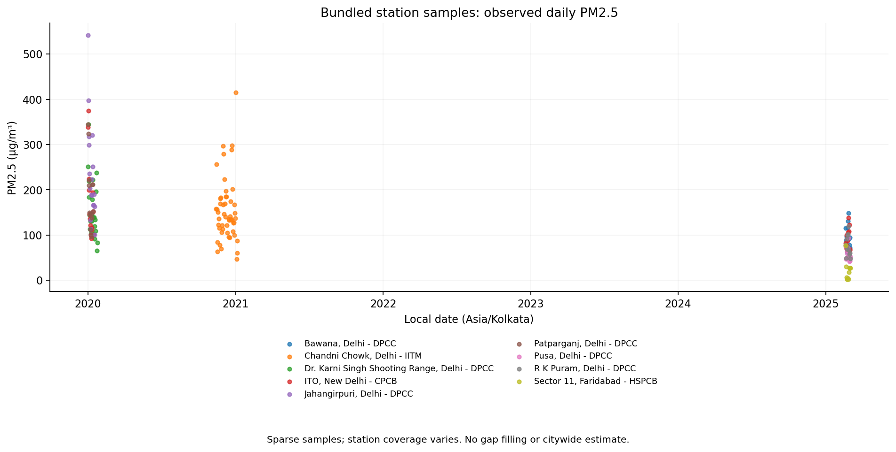

# Clean Air OS

**An inspectable air-quality research project for Delhi and nearby stations.**

Clean Air OS pairs a policy and governance concept with a reproducible, offline
PM2.5 analysis. The maintained workflow reads the data already in this repository,
validates observations, preserves missing days, and produces station-level summaries
with explicit coverage. No accounts, API keys, or Google Drive mount are required.

**Project status:** a runnable research baseline and historical policy proposal.
It is not a deployed monitoring platform. The committed exports are sparse samples;
they do not support a complete 2020–2025 Delhi trend, regulatory compliance findings,
or attribution of pollution to particular causes.

## Run the analysis

Use Python **3.11–3.13** from the repository root:

```sh
git clone https://github.com/adityashroff06-code/Clean_Air_OS.git
cd Clean_Air_OS
python -m venv .venv
```

Activate the environment:

```sh
# macOS / Linux
source .venv/bin/activate
```

```powershell
# Windows PowerShell
.venv\Scripts\Activate.ps1
```

Then install and run:

```sh
python -m pip install -r requirements.txt
python -m clean_air_os
```

The command creates `outputs/` with four CSV tables, a quality/provenance manifest,
and `station_samples.png`. Installation needs internet access; analysis of the
bundled archive does not. See [setup and troubleshooting](docs/SETUP.md) for a
notebook workflow and environment details.

## What the project produces

| Output | What it means |
| --- | --- |
| `station_daily.csv` | Observed daily mean and sample count for each station |
| `sampled_network_daily.csv` | Equal mean of available station-day means; missing dates remain empty |
| `station_coverage.csv` | Each station's observed period, observation count, and available-day mean |
| `yearly_coverage.csv` | Available-day mean with calendar-year coverage; **not a complete annual mean** |
| `summary.json` | Input SHA-256, selected/excluded files, rejected rows, duplicate count, and limitations |
| `station_samples.png` | Observed station-days shown as points, without connecting gaps across years |

The archive contains nine OpenAQ station exports, one fire-detection file, and one
derived ITO daily file. Most station exports contain exactly 1,000 PM2.5 rows and
cover only a short interval. Sector 11 is in Faridabad. The default workflow uses
only the nine station exports, so it does not double-count the derived ITO data.
Read the [data inventory](docs/DATA.md) and [methodology](docs/METHODOLOGY.md) before
comparing stations or years.

## Example from the bundled data



The validated snapshot retains **9,992 observations from 9 stations on 88 distinct
local dates**, after rejecting eight negative readings. There are no retained
observations in 2022–2024. This chart is generated by the maintained workflow from
the committed archive; the sparse coverage is part of the result.

## Explore the project

| Resource | Purpose |
| --- | --- |
| [Clean_Air_OS.ipynb](Clean_Air_OS.ipynb) | Maintained notebook using the same offline analysis as the command |
| [Architecture](docs/ARCHITECTURE.md) | Data flow, module boundaries, and extension points |
| [Setup](docs/SETUP.md) | Installation, configuration, notebook use, and troubleshooting |
| [Data and provenance](docs/DATA.md) | Actual input schemas, source attribution, and coverage |
| [Methodology and limitations](docs/METHODOLOGY.md) | Cleaning, aggregation, missingness, and interpretation |
| [Historical research](docs/HISTORICAL_RESEARCH.md) | How to read the original notebook and governance deck |
| [Contribution guide](CONTRIBUTING.md) | Development checks and evidence required for changes |
| [Security](SECURITY.md) | Credentials, inputs, and reporting guidance |
| [Changelog](CHANGELOG.md) | Maintained-workflow changes |

The [original presentation](Clean_AIR_OS_FULL_DECK.pptx) is preserved as a historical
policy artifact. It has not been regenerated from the corrected workflow. Its
claims and charts require independent source and methodology review before reuse.

## Development

```sh
python -m pip install -r requirements-dev.txt
python -m pytest -q
python -m clean_air_os --no-charts --output outputs/check
```

Tests cover local-day boundaries, invalid readings, units, duplicate conflicts,
station weighting, missing dates, and the bundled archive. CI runs the tests and
executes the maintained notebook. See [CONTRIBUTING.md](CONTRIBUTING.md).

## Reuse and attribution

This repository currently has **no explicit software license**. Public visibility
does not itself grant a reuse license. Upstream data and the presentation may have
separate rights and attribution requirements; those have not been fully documented
by the original project. See [data provenance](docs/DATA.md#provenance-and-reuse).
