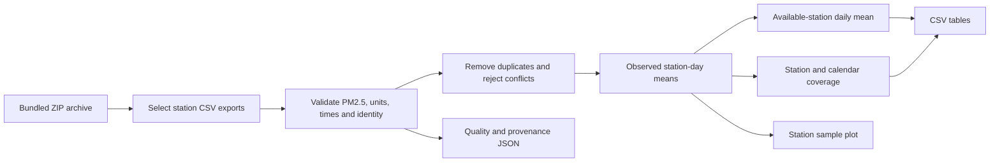

# Architecture

The maintained project is a local batch analysis, with a command-line interface and
a notebook sharing one implementation. It has no web service or persistent backend.

| Component | Responsibility |
| --- | --- |
| `clean_air_os/analysis.py:clean_frame` | Input schema validation, parameter selection, cleaning, rejection accounting |
| `load_observations` | ZIP reading, source tracking, deduplication, conflict detection, local dates |
| `summarize` | Station-day aggregation, equal station weighting, unfilled calendar gaps, coverage tables |
| `plot_coverage` | Headless chart of observed station-days |
| `run_analysis` | Report orchestration and input checksum |
| `clean_air_os/__main__.py` | Command options and actionable error messages |
| `Clean_Air_OS.ipynb` | Interactive inspection of the same tables |
| `tests/test_analysis.py` | Cleaning and aggregation regression tests plus bundled-data integration |
| `scripts/check_notebook.py` | Execute maintained notebook from a fresh kernel |

The archive is read directly; the large FIRMS member is not loaded by the default
workflow. Selected station CSVs are held in memory, which is suitable for the
committed sample sizes. Full historical ingestion would need chunking, partitioned
storage, explicit source versioning, and reviewed quality rules.

All outputs are derived artifacts and ignored by Git. No deployment is needed:
deliver reports by running the command against a recorded input archive and
retaining the generated manifest with the reports.

## Extension boundaries

Add new source adapters independently of `summarize`, preserving the observation
contract: station identity, timezone-aware timestamp, validated PM2.5 in µg/m³, and
source reference. Before accepting denser or multi-sensor exports, define sensor
identity and sampling/completeness rules. Add meteorology or fire analysis as a
separate, versioned join with explicit spatial and temporal alignment; regional
correlation is not a causal attribution method.
